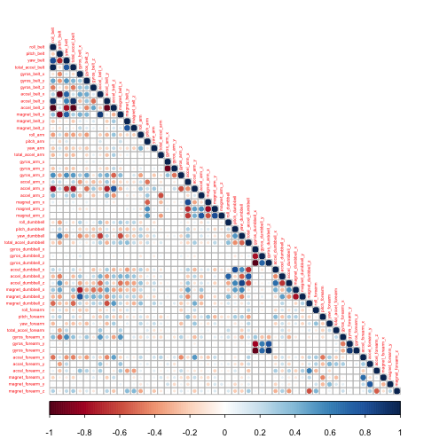
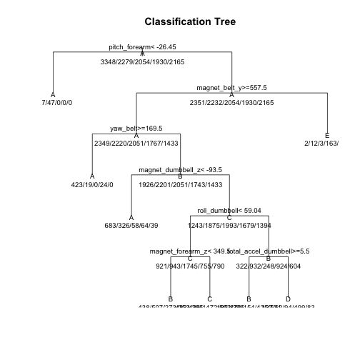
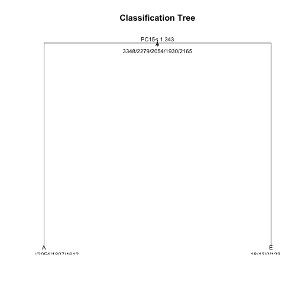

## Human Activity Recognition Study based on a Weight Lifting Exercises Dataset
##         
## Synopsis

## In this report we will analyze data about personal activity. The data is derived from accelerometers on the belt, forearm, arm, and dumbbell of six young healthy participants who were asked to perform one set of 10 repetitions of the Unilateral Dumbbell Biceps Curl in five different fashions: exactly according to the specification (Class A), throwing the elbows to the front (Class B), lifting the dumbbell only halfway (Class C), lowering the dumbbell only halfway (Class D), and throwing the hips to the front (Class E).

## The main study objective is to provide an answer to the questions:
## In which manner did the participants do the exercise? (This is shown in the "classe" variable in the training set.)

## How was the model built?
## How was cross validation used?
## What is the expected out-of-sample error?
## What are the classes predicted by the prediction model for 20 different test cases?
##  
## The data was separated into a training set for building the model, a test set for the evaluation of the model by cross-validation and for the comparison of different models, and a validation set to calculate the out-of-sample error (accuracy) of the selected model.

## The training set was reduced by removing zero covariates, then by eliminating the values that the authors of the study had calculated for the Euler angles of each of the four sensors. These values were: mean, variance, standard deviation, max, min, amplitude, kurtosis and skewness. At this point, the remaining variables were analyzed to identify their correlation; variables that were highly correlated with others were eliminated.

## A model was created with the tree prediction (rpart) method; this did not produce a satisfactory accuracy. A second version that included pca preprocessing was not acceptable either.

## Another model used was the random forest; the code execution is time consuming and resource intensive, and for this reason some adjustments of the parameters were necessary. The accuracy of this model was much better than the accuracy of the other models; so it was chosen.

## The accuracy of this selected model was calculated with the validation set to provide a measurement of the out-of-sample error; in addition, the classes were predicted by the prediction model for 20 different test cases; these results were provided to the Coursera site and accepted as correct.


## Reference Documents

#### Velloso, E.; Bulling, A.; Gellersen, H.; Ugulino, W.; Fuks, H. Qualitative Activity Recognition of Weight Lifting Exercises. Proceedings of 4th International Conference in Cooperation with SIGCHI (Augmented Human '13) . Stuttgart, Germany: ACM SIGCHI, 2013.

[Human Activity Recognition] (http://groupware.les.inf.puc-rio.br/har)

[Qualitative Activity Recognition of Weight Lifting Exercises] (http://groupware.les.inf.puc-rio.br/public/papers/2013.Velloso.QAR-WLE.pdf)

[Additional Information] (http://groupware.les.inf.puc-rio.br/har#ixzz3oASyPAq3)

## 

## Loading of packages


```r
library(lubridate)
library(plyr)
library(dplyr)
library(ggplot2)
library(tidyr)
library(lattice)
library(knitr)
library(curl)
library(stringr)
library(xtable)
library(gridExtra)
library(caret)
library(ElemStatLearn)
library(pgmm)
library(rpart)
library(AppliedPredictiveModeling)
library(kernlab)
library(corrplot)
```
## Step 1 Data Processing

### Loading and preprocessing the data

#### 1.1. Load the data (i.e. read.csv() )
###### This procedure was tested with a Macintosh

##### 1.1.2 Download the file

###### Set up the URL

```r
fileURL1 <- "https://d396qusza40orc.cloudfront.net/predmachlearn/pml-training.csv"
fileURL2 <- "https://d396qusza40orc.cloudfront.net/predmachlearn/pml-testing.csv"
```

###### Download the files for Windows Mac or other OS

###### Verify the operating system and download

```r
if(.Platform$OS.type == "windows"){ ## for windows
        download.file(url=fileURL1, destfile = "pml-training.csv")}
if(.Platform$OS.type != "windows"){ ## for Mac, Linux and other OS
        download.file(url=fileURL1, destfile = "pml-training.csv", 
                      method="curl")}


if(.Platform$OS.type == "windows"){ ## for windows
        download.file(url=fileURL2, destfile = "pml-testing.csv")}
if(.Platform$OS.type != "windows"){ ## for Mac, Linux and other OS
        download.file(url=fileURL2, destfile = "pml-testing.csv", 
                      method="curl")}
```


##### 1.1.3 Read the file for training


```r
data_from_training <- read.csv("pml-training.csv", header = TRUE, na.strings=c("NA", "#DIV/0!"))
```

###### Check the file

```r
str(data_from_training)
```

```
## 'data.frame':	19622 obs. of  160 variables:
##  $ X                       : int  1 2 3 4 5 6 7 8 9 10 ...
##  $ user_name               : Factor w/ 6 levels "adelmo","carlitos",..: 2 2 2 2 2 2 2 2 2 2 ...
##  $ raw_timestamp_part_1    : int  1323084231 1323084231 1323084231 1323084232 1323084232 1323084232 1323084232 1323084232 1323084232 1323084232 ...
##  $ raw_timestamp_part_2    : int  788290 808298 820366 120339 196328 304277 368296 440390 484323 484434 ...
##  $ cvtd_timestamp          : Factor w/ 20 levels "02/12/2011 13:32",..: 9 9 9 9 9 9 9 9 9 9 ...
##  $ new_window              : Factor w/ 2 levels "no","yes": 1 1 1 1 1 1 1 1 1 1 ...
##  $ num_window              : int  11 11 11 12 12 12 12 12 12 12 ...
##  $ roll_belt               : num  1.41 1.41 1.42 1.48 1.48 1.45 1.42 1.42 1.43 1.45 ...
##  $ pitch_belt              : num  8.07 8.07 8.07 8.05 8.07 8.06 8.09 8.13 8.16 8.17 ...
##  $ yaw_belt                : num  -94.4 -94.4 -94.4 -94.4 -94.4 -94.4 -94.4 -94.4 -94.4 -94.4 ...
##  $ total_accel_belt        : int  3 3 3 3 3 3 3 3 3 3 ...
##  $ kurtosis_roll_belt      : num  NA NA NA NA NA NA NA NA NA NA ...
##  $ kurtosis_picth_belt     : num  NA NA NA NA NA NA NA NA NA NA ...
##  $ kurtosis_yaw_belt       : logi  NA NA NA NA NA NA ...
##  $ skewness_roll_belt      : num  NA NA NA NA NA NA NA NA NA NA ...
##  $ skewness_roll_belt.1    : num  NA NA NA NA NA NA NA NA NA NA ...
##  $ skewness_yaw_belt       : logi  NA NA NA NA NA NA ...
##  $ max_roll_belt           : num  NA NA NA NA NA NA NA NA NA NA ...
##  $ max_picth_belt          : int  NA NA NA NA NA NA NA NA NA NA ...
##  $ max_yaw_belt            : num  NA NA NA NA NA NA NA NA NA NA ...
##  $ min_roll_belt           : num  NA NA NA NA NA NA NA NA NA NA ...
##  $ min_pitch_belt          : int  NA NA NA NA NA NA NA NA NA NA ...
##  $ min_yaw_belt            : num  NA NA NA NA NA NA NA NA NA NA ...
##  $ amplitude_roll_belt     : num  NA NA NA NA NA NA NA NA NA NA ...
##  $ amplitude_pitch_belt    : int  NA NA NA NA NA NA NA NA NA NA ...
##  $ amplitude_yaw_belt      : num  NA NA NA NA NA NA NA NA NA NA ...
##  $ var_total_accel_belt    : num  NA NA NA NA NA NA NA NA NA NA ...
##  $ avg_roll_belt           : num  NA NA NA NA NA NA NA NA NA NA ...
##  $ stddev_roll_belt        : num  NA NA NA NA NA NA NA NA NA NA ...
##  $ var_roll_belt           : num  NA NA NA NA NA NA NA NA NA NA ...
##  $ avg_pitch_belt          : num  NA NA NA NA NA NA NA NA NA NA ...
##  $ stddev_pitch_belt       : num  NA NA NA NA NA NA NA NA NA NA ...
##  $ var_pitch_belt          : num  NA NA NA NA NA NA NA NA NA NA ...
##  $ avg_yaw_belt            : num  NA NA NA NA NA NA NA NA NA NA ...
##  $ stddev_yaw_belt         : num  NA NA NA NA NA NA NA NA NA NA ...
##  $ var_yaw_belt            : num  NA NA NA NA NA NA NA NA NA NA ...
##  $ gyros_belt_x            : num  0 0.02 0 0.02 0.02 0.02 0.02 0.02 0.02 0.03 ...
##  $ gyros_belt_y            : num  0 0 0 0 0.02 0 0 0 0 0 ...
##  $ gyros_belt_z            : num  -0.02 -0.02 -0.02 -0.03 -0.02 -0.02 -0.02 -0.02 -0.02 0 ...
##  $ accel_belt_x            : int  -21 -22 -20 -22 -21 -21 -22 -22 -20 -21 ...
##  $ accel_belt_y            : int  4 4 5 3 2 4 3 4 2 4 ...
##  $ accel_belt_z            : int  22 22 23 21 24 21 21 21 24 22 ...
##  $ magnet_belt_x           : int  -3 -7 -2 -6 -6 0 -4 -2 1 -3 ...
##  $ magnet_belt_y           : int  599 608 600 604 600 603 599 603 602 609 ...
##  $ magnet_belt_z           : int  -313 -311 -305 -310 -302 -312 -311 -313 -312 -308 ...
##  $ roll_arm                : num  -128 -128 -128 -128 -128 -128 -128 -128 -128 -128 ...
##  $ pitch_arm               : num  22.5 22.5 22.5 22.1 22.1 22 21.9 21.8 21.7 21.6 ...
##  $ yaw_arm                 : num  -161 -161 -161 -161 -161 -161 -161 -161 -161 -161 ...
##  $ total_accel_arm         : int  34 34 34 34 34 34 34 34 34 34 ...
##  $ var_accel_arm           : num  NA NA NA NA NA NA NA NA NA NA ...
##  $ avg_roll_arm            : num  NA NA NA NA NA NA NA NA NA NA ...
##  $ stddev_roll_arm         : num  NA NA NA NA NA NA NA NA NA NA ...
##  $ var_roll_arm            : num  NA NA NA NA NA NA NA NA NA NA ...
##  $ avg_pitch_arm           : num  NA NA NA NA NA NA NA NA NA NA ...
##  $ stddev_pitch_arm        : num  NA NA NA NA NA NA NA NA NA NA ...
##  $ var_pitch_arm           : num  NA NA NA NA NA NA NA NA NA NA ...
##  $ avg_yaw_arm             : num  NA NA NA NA NA NA NA NA NA NA ...
##  $ stddev_yaw_arm          : num  NA NA NA NA NA NA NA NA NA NA ...
##  $ var_yaw_arm             : num  NA NA NA NA NA NA NA NA NA NA ...
##  $ gyros_arm_x             : num  0 0.02 0.02 0.02 0 0.02 0 0.02 0.02 0.02 ...
##  $ gyros_arm_y             : num  0 -0.02 -0.02 -0.03 -0.03 -0.03 -0.03 -0.02 -0.03 -0.03 ...
##  $ gyros_arm_z             : num  -0.02 -0.02 -0.02 0.02 0 0 0 0 -0.02 -0.02 ...
##  $ accel_arm_x             : int  -288 -290 -289 -289 -289 -289 -289 -289 -288 -288 ...
##  $ accel_arm_y             : int  109 110 110 111 111 111 111 111 109 110 ...
##  $ accel_arm_z             : int  -123 -125 -126 -123 -123 -122 -125 -124 -122 -124 ...
##  $ magnet_arm_x            : int  -368 -369 -368 -372 -374 -369 -373 -372 -369 -376 ...
##  $ magnet_arm_y            : int  337 337 344 344 337 342 336 338 341 334 ...
##  $ magnet_arm_z            : int  516 513 513 512 506 513 509 510 518 516 ...
##  $ kurtosis_roll_arm       : num  NA NA NA NA NA NA NA NA NA NA ...
##  $ kurtosis_picth_arm      : num  NA NA NA NA NA NA NA NA NA NA ...
##  $ kurtosis_yaw_arm        : num  NA NA NA NA NA NA NA NA NA NA ...
##  $ skewness_roll_arm       : num  NA NA NA NA NA NA NA NA NA NA ...
##  $ skewness_pitch_arm      : num  NA NA NA NA NA NA NA NA NA NA ...
##  $ skewness_yaw_arm        : num  NA NA NA NA NA NA NA NA NA NA ...
##  $ max_roll_arm            : num  NA NA NA NA NA NA NA NA NA NA ...
##  $ max_picth_arm           : num  NA NA NA NA NA NA NA NA NA NA ...
##  $ max_yaw_arm             : int  NA NA NA NA NA NA NA NA NA NA ...
##  $ min_roll_arm            : num  NA NA NA NA NA NA NA NA NA NA ...
##  $ min_pitch_arm           : num  NA NA NA NA NA NA NA NA NA NA ...
##  $ min_yaw_arm             : int  NA NA NA NA NA NA NA NA NA NA ...
##  $ amplitude_roll_arm      : num  NA NA NA NA NA NA NA NA NA NA ...
##  $ amplitude_pitch_arm     : num  NA NA NA NA NA NA NA NA NA NA ...
##  $ amplitude_yaw_arm       : int  NA NA NA NA NA NA NA NA NA NA ...
##  $ roll_dumbbell           : num  13.1 13.1 12.9 13.4 13.4 ...
##  $ pitch_dumbbell          : num  -70.5 -70.6 -70.3 -70.4 -70.4 ...
##  $ yaw_dumbbell            : num  -84.9 -84.7 -85.1 -84.9 -84.9 ...
##  $ kurtosis_roll_dumbbell  : num  NA NA NA NA NA NA NA NA NA NA ...
##  $ kurtosis_picth_dumbbell : num  NA NA NA NA NA NA NA NA NA NA ...
##  $ kurtosis_yaw_dumbbell   : logi  NA NA NA NA NA NA ...
##  $ skewness_roll_dumbbell  : num  NA NA NA NA NA NA NA NA NA NA ...
##  $ skewness_pitch_dumbbell : num  NA NA NA NA NA NA NA NA NA NA ...
##  $ skewness_yaw_dumbbell   : logi  NA NA NA NA NA NA ...
##  $ max_roll_dumbbell       : num  NA NA NA NA NA NA NA NA NA NA ...
##  $ max_picth_dumbbell      : num  NA NA NA NA NA NA NA NA NA NA ...
##  $ max_yaw_dumbbell        : num  NA NA NA NA NA NA NA NA NA NA ...
##  $ min_roll_dumbbell       : num  NA NA NA NA NA NA NA NA NA NA ...
##  $ min_pitch_dumbbell      : num  NA NA NA NA NA NA NA NA NA NA ...
##  $ min_yaw_dumbbell        : num  NA NA NA NA NA NA NA NA NA NA ...
##  $ amplitude_roll_dumbbell : num  NA NA NA NA NA NA NA NA NA NA ...
##   [list output truncated]
```

```r
dim(data_from_training)
```

```
## [1] 19622   160
```

##### 1.1.4 Split the data into training, testing and validation subset

###### 1.1.4.1 Split the data into training and another group
  

```r
inTrain <- createDataPartition(y=data_from_training$classe, p=0.6, list=FALSE)
data_train <- data_from_training[inTrain,]
data_total_test_from_training <- data_from_training[-inTrain,]
```


####### 1.1.4.2 Create another partition of the 40% of the data, and get 20% testing and 20% validation


```r
inValidation <- createDataPartition(data_total_test_from_training$classe, p=0.5, list=FALSE)
data_test_from_training <- data_total_test_from_training[inValidation,]
data_validation_from_training <- data_total_test_from_training[-inValidation,]
```
###### Check the data separation

```r
dim(data_train)
```

```
## [1] 11776   160
```

```r
dim(data_test_from_training)
```

```
## [1] 3923  160
```

```r
dim(data_validation_from_training)
```

```
## [1] 3923  160
```

##### 1.1.5 Read the file for testing

```r
data_test <- read.csv("pml-testing.csv", header = TRUE, na.strings=c("NA", "#DIV/0!"))
```


##### 1.1.6 Preprocess training data
###### Remove zero covariates

```r
nsv <- nearZeroVar(data_train,saveMetrics=TRUE)
index_non_zero_features <- !(nsv$nzv)
```
###### Select train data with non zero features


```r
data_train_non_zero <- data_train[index_non_zero_features]
```

##### 1.1.7.1 Perform a similar change for the testing data


```r
data_test_non_zero <- data_test_from_training[index_non_zero_features]
```

##### 1.1.7.2 Perform a similar change for the validation data


```r
data_validation_non_zero <- data_validation_from_training[index_non_zero_features]
```

##### 1.1.8 Eliminate derived variables
###### The authors of the study had calculated variables for the Euler angles of each of the four sensors; these can be eliminated. These variables were: mean, variance, standard deviation, max, min, amplitude, kurtosis and skewness. Their names begin with avg, var, stddev, max, min, amplitude, kurtosis and skewness.

##### 

```r
data_train_reduced_1 <- select(data_train_non_zero, -starts_with("kurtosis"))
data_train_reduced_2 <- select(data_train_reduced_1, -starts_with("skewness"))
data_train_reduced_3 <- select(data_train_reduced_2, -starts_with("min"))
data_train_reduced_4 <- select(data_train_reduced_3, -starts_with("max"))
data_train_reduced_5 <- select(data_train_reduced_4, -starts_with("var"))
data_train_reduced_6 <- select(data_train_reduced_5, -starts_with("stddev"))
data_train_reduced_7 <- select(data_train_reduced_6, -starts_with("amplitude"))
data_train_reduced_8 <- select(data_train_reduced_7, -starts_with("avg"))
```

##### 1.1.9 Eliminate variables non relevant to this study


###### Some variables indicate testing intervals and the names of participants


```r
data_train_reduced_9 <- select(data_train_reduced_8, -(X:num_window))
dim(data_train_reduced_9)
```

```
## [1] 11776    53
```


##### 1.1.10.1 Perform the same changes for the testing data
######   

```r
data_test_reduced_1 <- select(data_test_non_zero, -starts_with("kurtosis"))
data_test_reduced_2 <- select(data_test_reduced_1, -starts_with("skewness"))
data_test_reduced_3 <- select(data_test_reduced_2, -starts_with("min"))
data_test_reduced_4 <- select(data_test_reduced_3, -starts_with("max"))
data_test_reduced_5 <- select(data_test_reduced_4, -starts_with("var"))
data_test_reduced_6 <- select(data_test_reduced_5, -starts_with("stddev"))
data_test_reduced_7 <- select(data_test_reduced_6, -starts_with("amplitude"))
data_test_reduced_8 <- select(data_test_reduced_7, -starts_with("avg"))

data_test_reduced_9 <- select(data_test_reduced_8, -(X:num_window))

dim(data_test_reduced_9)
```

```
## [1] 3923   53
```


##### 1.1.10.2 Perform the same changes for the validation data
######   

```r
data_validation_reduced_1 <- select(data_validation_non_zero, -starts_with("kurtosis"))
data_validation_reduced_2 <- select(data_validation_reduced_1, -starts_with("skewness"))
data_validation_reduced_3 <- select(data_validation_reduced_2, -starts_with("min"))
data_validation_reduced_4 <- select(data_validation_reduced_3, -starts_with("max"))
data_validation_reduced_5 <- select(data_validation_reduced_4, -starts_with("var"))
data_validation_reduced_6 <- select(data_validation_reduced_5, -starts_with("stddev"))
data_validation_reduced_7 <- select(data_validation_reduced_6, -starts_with("amplitude"))
data_validation_reduced_8 <- select(data_validation_reduced_7, -starts_with("avg"))

data_validation_reduced_9 <- select(data_validation_reduced_8, -(X:num_window))

dim(data_validation_reduced_9)
```

```
## [1] 3923   53
```

##### 1.1.11 Analyze the correlation of the variables


```r
corrplot(cor(data_train_reduced_9[,-53]), type = "lower",tl.cex=0.4)
```

 

###### Reduce the number of variables on the basis of the correlation 

```r
data_train_cor <-  cor(data_train_reduced_9[,-53])
highCorr <- sum(abs(data_train_cor[upper.tri(data_train_cor)]) > .999)
highCorr
```

```
## [1] 0
```

```r
summary(data_train_cor[upper.tri(data_train_cor)])
```

```
##      Min.   1st Qu.    Median      Mean   3rd Qu.      Max. 
## -0.992000 -0.108700  0.002424  0.001595  0.090440  0.980200
```

```r
highlyCordata_train <- findCorrelation(data_train_cor, cutoff = .75)
highlyCordata_train
```

```
##  [1] 10  1  9 22  4 36  8  2 35 37 38 34 21 23 25 13 48 45 31 33 18
```

```r
data_train_reduced_11 <- data_train_reduced_9[,-highlyCordata_train]

dim(data_train_reduced_11)
```

```
## [1] 11776    32
```

```r
names(data_train_reduced_11)
```

```
##  [1] "yaw_belt"             "gyros_belt_x"         "gyros_belt_y"        
##  [4] "gyros_belt_z"         "magnet_belt_x"        "magnet_belt_y"       
##  [7] "roll_arm"             "pitch_arm"            "yaw_arm"             
## [10] "total_accel_arm"      "gyros_arm_y"          "gyros_arm_z"         
## [13] "magnet_arm_x"         "magnet_arm_z"         "roll_dumbbell"       
## [16] "pitch_dumbbell"       "yaw_dumbbell"         "total_accel_dumbbell"
## [19] "gyros_dumbbell_y"     "magnet_dumbbell_z"    "roll_forearm"        
## [22] "pitch_forearm"        "yaw_forearm"          "total_accel_forearm" 
## [25] "gyros_forearm_x"      "gyros_forearm_z"      "accel_forearm_x"     
## [28] "accel_forearm_z"      "magnet_forearm_x"     "magnet_forearm_y"    
## [31] "magnet_forearm_z"     "classe"
```

####### The result is a dataset data_train_reduced_11 that includes the outcome, and a total of 32 other variables


###### Make the same changes to the test data


```r
data_test_reduced_11 <- data_test_reduced_9[,-highlyCordata_train]
```

###### Make the same changes to the validation data


```r
data_validation_reduced_11 <- data_validation_reduced_9[,-highlyCordata_train]
```


#### 2.1. Evaluate models

##### 2.1.1 The first model is based on trees 

```r
modFit_rpart <- train(classe ~ ., method="rpart", data = data_train_reduced_11)
print(modFit_rpart$finalModel)
```

```
## n= 11776 
## 
## node), split, n, loss, yval, (yprob)
##       * denotes terminal node
## 
##   1) root 11776 8428 A (0.28 0.19 0.17 0.16 0.18)  
##     2) pitch_forearm< -26.45 1044   47 A (0.95 0.045 0 0 0) *
##     3) pitch_forearm>=-26.45 10732 8381 A (0.22 0.21 0.19 0.18 0.2)  
##       6) magnet_belt_y>=557.5 9820 7471 A (0.24 0.23 0.21 0.18 0.15)  
##        12) yaw_belt>=169.5 466   43 A (0.91 0.041 0 0.052 0) *
##        13) yaw_belt< 169.5 9354 7153 B (0.21 0.24 0.22 0.19 0.15)  
##          26) magnet_dumbbell_z< -93.5 1170  487 A (0.58 0.28 0.05 0.055 0.033) *
##          27) magnet_dumbbell_z>=-93.5 8184 6191 C (0.15 0.23 0.24 0.21 0.17)  
##            54) roll_dumbbell< 59.04271 5154 3409 C (0.18 0.18 0.34 0.15 0.15)  
##             108) magnet_forearm_z< 349.5 1866 1359 B (0.23 0.27 0.15 0.14 0.21) *
##             109) magnet_forearm_z>=349.5 3288 1816 C (0.15 0.13 0.45 0.15 0.12) *
##            55) roll_dumbbell>=59.04271 3030 2098 B (0.11 0.31 0.082 0.3 0.2)  
##             110) total_accel_dumbbell>=5.5 2155 1285 B (0.086 0.4 0.071 0.2 0.24) *
##             111) total_accel_dumbbell< 5.5 875  376 D (0.16 0.071 0.11 0.57 0.095) *
##       7) magnet_belt_y< 557.5 912  180 E (0.0022 0.013 0.0033 0.18 0.8) *
```

###### Print the picture 


```r
plot(modFit_rpart$finalModel, uniform=TRUE, 
     main="Classification Tree")
text(modFit_rpart$finalModel, use.n=TRUE, all=TRUE, cex=.8)
```

 


###### View the accuracy in the confusion matrix 


```r
confusionMatrix(data_test_reduced_11$classe,predict(modFit_rpart,data_test_reduced_11))
```

```
## Confusion Matrix and Statistics
## 
##           Reference
## Prediction   A   B   C   D   E
##          A 704 202 155  53   2
##          B 129 454 151  21   4
##          C  18 146 484  33   3
##          D  29 235 127 197  55
##          E  10 327 118  31 235
## 
## Overall Statistics
##                                           
##                Accuracy : 0.5287          
##                  95% CI : (0.5129, 0.5444)
##     No Information Rate : 0.3477          
##     P-Value [Acc > NIR] : < 2.2e-16       
##                                           
##                   Kappa : 0.4065          
##  Mcnemar's Test P-Value : < 2.2e-16       
## 
## Statistics by Class:
## 
##                      Class: A Class: B Class: C Class: D Class: E
## Sensitivity            0.7910   0.3328   0.4676  0.58806  0.78595
## Specificity            0.8642   0.8808   0.9307  0.87570  0.86589
## Pos Pred Value         0.6308   0.5982   0.7076  0.30638  0.32594
## Neg Pred Value         0.9337   0.7124   0.8299  0.95793  0.98001
## Prevalence             0.2269   0.3477   0.2638  0.08539  0.07622
## Detection Rate         0.1795   0.1157   0.1234  0.05022  0.05990
## Detection Prevalence   0.2845   0.1935   0.1744  0.16391  0.18379
## Balanced Accuracy      0.8276   0.6068   0.6992  0.73188  0.82592
```


##### 2.1.2 The second model is based on trees with pca preprocessing


```r
modFit_rpart_with_pca <- train(classe ~ ., method="rpart",preProcess="pca", data = data_train_reduced_11)
print(modFit_rpart_with_pca$finalModel)
```

```
## n= 11776 
## 
## node), split, n, loss, yval, (yprob)
##       * denotes terminal node
## 
## 1) root 11776 8428 A (0.28 0.19 0.17 0.16 0.18)  
##   2) PC15< 1.343204 11069 7739 A (0.3 0.2 0.19 0.16 0.15) *
##   3) PC15>=1.343204 707  154 E (0.025 0.018 0 0.17 0.78) *
```

###### Print the picture 


```r
plot(modFit_rpart_with_pca$finalModel, uniform=TRUE, 
     main="Classification Tree")
text(modFit_rpart_with_pca$finalModel, use.n=TRUE, all=TRUE, cex=.8)
```

 


###### View the accuracy in the confusion matrix 


```r
confusionMatrix(data_test_reduced_11$classe,predict(modFit_rpart_with_pca,data_test_reduced_11))
```

```
## Confusion Matrix and Statistics
## 
##           Reference
## Prediction    A    B    C    D    E
##          A 1111    0    0    0    5
##          B  751    0    0    0    8
##          C  684    0    0    0    0
##          D  600    0    0    0   43
##          E  552    0    0    0  169
## 
## Overall Statistics
##                                           
##                Accuracy : 0.3263          
##                  95% CI : (0.3116, 0.3412)
##     No Information Rate : 0.9426          
##     P-Value [Acc > NIR] : 1               
##                                           
##                   Kappa : 0.066           
##  Mcnemar's Test P-Value : NA              
## 
## Statistics by Class:
## 
##                      Class: A Class: B Class: C Class: D Class: E
## Sensitivity           0.30043       NA       NA       NA  0.75111
## Specificity           0.97778   0.8065   0.8256   0.8361  0.85073
## Pos Pred Value        0.99552       NA       NA       NA  0.23440
## Neg Pred Value        0.07838       NA       NA       NA  0.98251
## Prevalence            0.94265   0.0000   0.0000   0.0000  0.05735
## Detection Rate        0.28320   0.0000   0.0000   0.0000  0.04308
## Detection Prevalence  0.28448   0.1935   0.1744   0.1639  0.18379
## Balanced Accuracy     0.63911       NA       NA       NA  0.80092
```

##### 2.1.3 The third model is based on random trees

###### The model computation might require adequate resources. We can set up the number of cores; we have a computer with 2, and we want to use only one. In addition, we choose parameters so that the computation is not too intensive. 


```r
library(doMC)
registerDoMC(cores=1)
```

#### Parameters setup
###### trControl: takes a list of control parameters for the function. The type of resampling as well as the number of resampling iterations can be set using this list. We choose no sampling to save execution time. tuneGrid: can be used to define a specific grid of tuning parameters. We use expand.grid to provide the different values for the number of variables randomly sampled as candidates at each split (mtry).

```r
fitControl    <- trainControl(method = "none")
tgrid           <- expand.grid(mtry=c(6)) 
```
 

###### Random Tree Model


```r
model  <- train(classe ~ ., data = data_train_reduced_11, method = "rf", trControl = fitControl, tuneGrid = tgrid)
```

###### View the accuracy in the confusion matrix 


```r
confusionMatrix(data_test_reduced_11$classe,predict(model,data_test_reduced_11))
```

```
## Confusion Matrix and Statistics
## 
##           Reference
## Prediction    A    B    C    D    E
##          A 1115    1    0    0    0
##          B    3  755    0    0    1
##          C    0    7  676    1    0
##          D    0    0    9  632    2
##          E    0    0    0    5  716
## 
## Overall Statistics
##                                          
##                Accuracy : 0.9926         
##                  95% CI : (0.9894, 0.995)
##     No Information Rate : 0.285          
##     P-Value [Acc > NIR] : < 2.2e-16      
##                                          
##                   Kappa : 0.9906         
##  Mcnemar's Test P-Value : NA             
## 
## Statistics by Class:
## 
##                      Class: A Class: B Class: C Class: D Class: E
## Sensitivity            0.9973   0.9895   0.9869   0.9906   0.9958
## Specificity            0.9996   0.9987   0.9975   0.9967   0.9984
## Pos Pred Value         0.9991   0.9947   0.9883   0.9829   0.9931
## Neg Pred Value         0.9989   0.9975   0.9972   0.9982   0.9991
## Prevalence             0.2850   0.1945   0.1746   0.1626   0.1833
## Detection Rate         0.2842   0.1925   0.1723   0.1611   0.1825
## Detection Prevalence   0.2845   0.1935   0.1744   0.1639   0.1838
## Balanced Accuracy      0.9985   0.9941   0.9922   0.9936   0.9971
```

#### 3.1. Select the model

##### We selected the Random Tree Model, because the result of the cross validation is the best, as shown in the accuracy value from the confusion matrix. 

#### 4.1 Expected out-of-sample error for the selected model

##### To calculate the cross validation error of the selected model, we used a dataset that had not been used previously for training or for model evaluation. Accuracy is a metric used for categorical outcomes.


```r
confusionMatrix(data_validation_reduced_11$classe,predict(model,data_validation_reduced_11))
```

```
## Confusion Matrix and Statistics
## 
##           Reference
## Prediction    A    B    C    D    E
##          A 1115    1    0    0    0
##          B    3  752    2    0    2
##          C    0   14  662    8    0
##          D    0    0   12  630    1
##          E    0    1    2    2  716
## 
## Overall Statistics
##                                          
##                Accuracy : 0.9878         
##                  95% CI : (0.9838, 0.991)
##     No Information Rate : 0.285          
##     P-Value [Acc > NIR] : < 2.2e-16      
##                                          
##                   Kappa : 0.9845         
##  Mcnemar's Test P-Value : NA             
## 
## Statistics by Class:
## 
##                      Class: A Class: B Class: C Class: D Class: E
## Sensitivity            0.9973   0.9792   0.9764   0.9844   0.9958
## Specificity            0.9996   0.9978   0.9932   0.9960   0.9984
## Pos Pred Value         0.9991   0.9908   0.9678   0.9798   0.9931
## Neg Pred Value         0.9989   0.9949   0.9951   0.9970   0.9991
## Prevalence             0.2850   0.1958   0.1728   0.1631   0.1833
## Detection Rate         0.2842   0.1917   0.1687   0.1606   0.1825
## Detection Prevalence   0.2845   0.1935   0.1744   0.1639   0.1838
## Balanced Accuracy      0.9985   0.9885   0.9848   0.9902   0.9971
```


#### 5.1 Classes predicted by the prediction model for 20 different test cases

```r
prediction_model <- predict(model,data_test)
prediction_model
```

```
##  [1] B A B A A E D B A A B C B A E E A B B B
## Levels: A B C D E
```
###### These results were provided to the Coursera site, and were accepted as correct.
